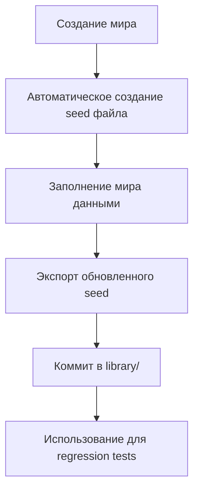

# 🌱 WelcomeCraft Seed Data Management System

**Версия:** 1.0.0  
**Дата:** 2025-07-02  
**Статус:** 🔧 ИНИЦИАЛИЗАЦИЯ - документация правильного подхода к управлению seed данными

---

## 🎯 Проблема и решение

### Текущая проблема
- Миры существуют в `worldMeta` конфигурации, но не имеют связанных данных в БД
- Отсутствует системный подход к созданию seed данных для новых миров
- Нет автоматизации для regression testing и воспроизведения багов
- Manual импорт seed данных не масштабируется

### Архитектурное решение: Centralized Seed Library

Создание централизованной системы управления seed данными с автоматизацией и четкими процессами.

---

## 🏗️ Архитектура Seed Data Management System

### 1. Структура директорий

```
seeds/
├── library/                    # 📚 Централизованная библиотека стандартных seeds
│   ├── ENTERPRISE_ONBOARDING/  # Seed для корпоративного онбординга
│   ├── GENERAL_001/            # Базовый seed для тестирования
│   ├── REGRESSION_UC_01/       # Seed для тестирования UC-01
│   └── EMPTY_WORLD/            # Пустой мир для чистого тестирования
├── generated/                  # 🤖 Автоматически созданные seeds
│   └── WORLD_20250702_123456/  # Timestamp-based seeds
├── backups/                    # 💾 Backup dumps из production
│   └── PROD_BACKUP_20250702/
└── README.md                   # Документация системы
```

### 2. Жизненный цикл мира с seed данными



---

## 🚀 Автоматизированные процессы

### Process 1: Создание нового мира для тестирования

```bash
# 1. Создать мир с автоматическим seed
pnpm phoenix:worlds:create --with-seed
# Автоматически создает: seeds/generated/NEW_WORLD_20250702_HHMMSS/

# 2. Заполнить мир тестовыми данными через UI
# Создать артефакты, чаты, настроить параметры

# 3. Экспортировать обновленный seed
pnpm phoenix:seed:export NEW_WORLD_ID --output library/REGRESSION_BUG_XXX

# 4. Коммитнуть seed в систему
git add seeds/library/REGRESSION_BUG_XXX/
git commit -m "feat: добавлен seed для regression testing BUG-XXX"
```

### Process 2: Импорт базовых seeds в новое окружение

```bash
# Batch импорт всех стандартных seeds
pnpm phoenix:seed:batch-import seeds/library/

# Импорт конкретного seed
pnpm phoenix:seed:import seeds/library/ENTERPRISE_ONBOARDING/
```

### Process 3: Regression Testing с seeds

```bash
# 1. Создать мир для воспроизведения бага
pnpm phoenix:seed:import seeds/library/REGRESSION_BUG_069/

# 2. Запустить тесты против этого мира
pnpm test:e2e --world REGRESSION_BUG_069

# 3. После фикса обновить seed
pnpm phoenix:seed:export REGRESSION_BUG_069 --update
```

---

## 📋 CLI команды для Seed Data Management

### Основные команды

```bash
# === СОЗДАНИЕ ===
pnpm phoenix:worlds:create --with-seed          # Создать мир с seed файлом
pnpm phoenix:seed:create WORLD_ID               # Создать seed для существующего мира

# === ИМПОРТ ===
pnpm phoenix:seed:import path/to/seed/          # Импорт конкретного seed
pnpm phoenix:seed:batch-import seeds/library/   # Batch импорт всех стандартных seeds
pnpm phoenix:seed:import --with-conflicts=merge # Импорт с разрешением конфликтов

# === ЭКСПОРТ ===
pnpm phoenix:seed:export WORLD_ID               # Экспорт мира в seed
pnpm phoenix:seed:export WORLD_ID --output library/CUSTOM_SEED  # Экспорт в конкретную папку
pnpm phoenix:seed:export WORLD_ID --update      # Обновить существующий seed

# === УПРАВЛЕНИЕ ===
pnpm phoenix:seed:list                          # Список всех доступных seeds
pnpm phoenix:seed:validate path/to/seed/        # Валидация seed структуры
pnpm phoenix:seed:diff SEED1 SEED2              # Сравнение двух seeds
pnpm phoenix:seed:cleanup                       # Очистка устаревших generated seeds
```

### Расширенные команды

```bash
# === LIBRARY MANAGEMENT ===
pnpm phoenix:seed:library:add NEW_SEED          # Добавить seed в library
pnpm phoenix:seed:library:remove OLD_SEED       # Удалить seed из library
pnpm phoenix:seed:library:update SEED_NAME      # Обновить seed в library

# === BACKUP & RESTORE ===
pnpm phoenix:seed:backup ENVIRONMENT            # Создать backup текущего окружения
pnpm phoenix:seed:restore BACKUP_NAME           # Восстановить из backup

# === TESTING INTEGRATION ===
pnpm phoenix:seed:test-setup UC_NAME            # Настроить окружение для UC тестирования
pnpm phoenix:seed:regression-setup BUG_ID       # Настроить окружение для regression testing
```

---

## 📚 Стандартная библиотека seeds

### ENTERPRISE_ONBOARDING
- **Назначение:** Демонстрация полного корпоративного онбординга
- **Содержимое:** 10 артефактов (site, person, faq-item, link, address, text)
- **Пользователи:** HR Admin, New Employee
- **Use Cases:** UC-01, UC-02, UC-03

### GENERAL_001
- **Назначение:** Базовый набор для общего тестирования
- **Содержимое:** Минимальный набор артефактов всех типов
- **Пользователи:** Test User
- **Use Cases:** Универсальные тесты

### REGRESSION_[BUG_ID]
- **Назначение:** Воспроизведение конкретных багов
- **Содержимое:** Минимальный набор для воспроизведения бага
- **Пользователи:** Специфичные для бага
- **Use Cases:** Regression testing

### EMPTY_WORLD
- **Назначение:** Чистое окружение для тестирования создания контента
- **Содержимое:** Только базовые пользователи, без артефактов
- **Пользователи:** Test User
- **Use Cases:** Create-from-scratch тесты

---

## 🔄 Workflow для команды разработки

### Разработчик обнаружил баг

1. **Воспроизведение:**
   ```bash
   # Создать мир для воспроизведения
   pnpm phoenix:worlds:create --with-seed --name "REGRESSION_BUG_069"
   
   # Наполнить мир данными для воспроизведения
   # ... работа через UI ...
   
   # Экспортировать seed
   pnpm phoenix:seed:export REGRESSION_BUG_069 --output library/REGRESSION_BUG_069
   ```

2. **Документирование:**
   ```bash
   # Коммитнуть seed в систему
   git add seeds/library/REGRESSION_BUG_069/
   git commit -m "feat: seed для воспроизведения BUG-069 (empty artifacts)"
   ```

3. **Тестирование fix:**
   ```bash
   # Импортировать seed в чистое окружение
   pnpm phoenix:seed:import seeds/library/REGRESSION_BUG_069/
   
   # Тестировать fix
   pnpm test:e2e --world REGRESSION_BUG_069
   ```

### QA тестирование

```bash
# Подготовить все standard seeds
pnpm phoenix:seed:batch-import seeds/library/

# Запустить full regression suite
pnpm test:e2e --all-worlds
```

---

## 🎯 Немедленные действия для BUG-069

### Шаг 1: Создать базовую библиотеку seeds

```bash
# Создать структуру директорий
mkdir -p seeds/library seeds/generated seeds/backups

# Переместить существующие seeds в library
mv seeds/ENTERPRISE_ONBOARDING_LOCAL_2025-07-02 seeds/library/ENTERPRISE_ONBOARDING
mv seeds/test-seed seeds/generated/test-seed
```

### Шаг 2: Импортировать Enterprise Onboarding

```bash
# Импортировать с автоматическим разрешением конфликтов
pnpm phoenix:seed:import seeds/library/ENTERPRISE_ONBOARDING --with-conflicts=replace
```

### Шаг 3: Обновить CLI команды

Добавить поддержку:
- `--with-seed` флаг для `phoenix:worlds:create`
- `phoenix:seed:batch-import` команда
- `--with-conflicts` опция для импорта

### Шаг 4: Документировать в Memory Bank

Обновить файлы:
- `tech-context.md` - добавить раздел Seed Data Management
- `WF-workflows.md` - добавить WF-11: Работа с seed данными
- `guides/phoenix-system-guide.md` - интеграция с Phoenix системой

---

## 🔧 Технические детали реализации

### Автоматическое создание seed при создании мира

```typescript
// scripts/phoenix-world-manager.ts
async function createWorld(options: { withSeed?: boolean }) {
  const world = await createWorldInDatabase(options)
  
  if (options.withSeed) {
    // Автоматически создать пустой seed файл
    await createSeedFile(world.id, {
      destination: `seeds/generated/${world.id}_${timestamp()}/`,
      includeMetadata: true,
      includeUsers: true,
      includeArtifacts: false // Пустой seed для наполнения
    })
  }
  
  return world
}
```

### Batch импорт seeds

```typescript
async function batchImportSeeds(directory: string) {
  const seedDirs = await fs.readdir(directory, { withFileTypes: true })
  
  for (const seedDir of seedDirs.filter(d => d.isDirectory())) {
    await importSeed(path.join(directory, seedDir.name), {
      conflictResolution: 'skip-if-exists',
      validateBeforeImport: true
    })
  }
}
```

---

> **Результат:** Централизованная система управления seed данными с автоматизацией, четкими процессами и интеграцией в Phoenix Project архитектуру для эффективного regression testing и воспроизведения багов.