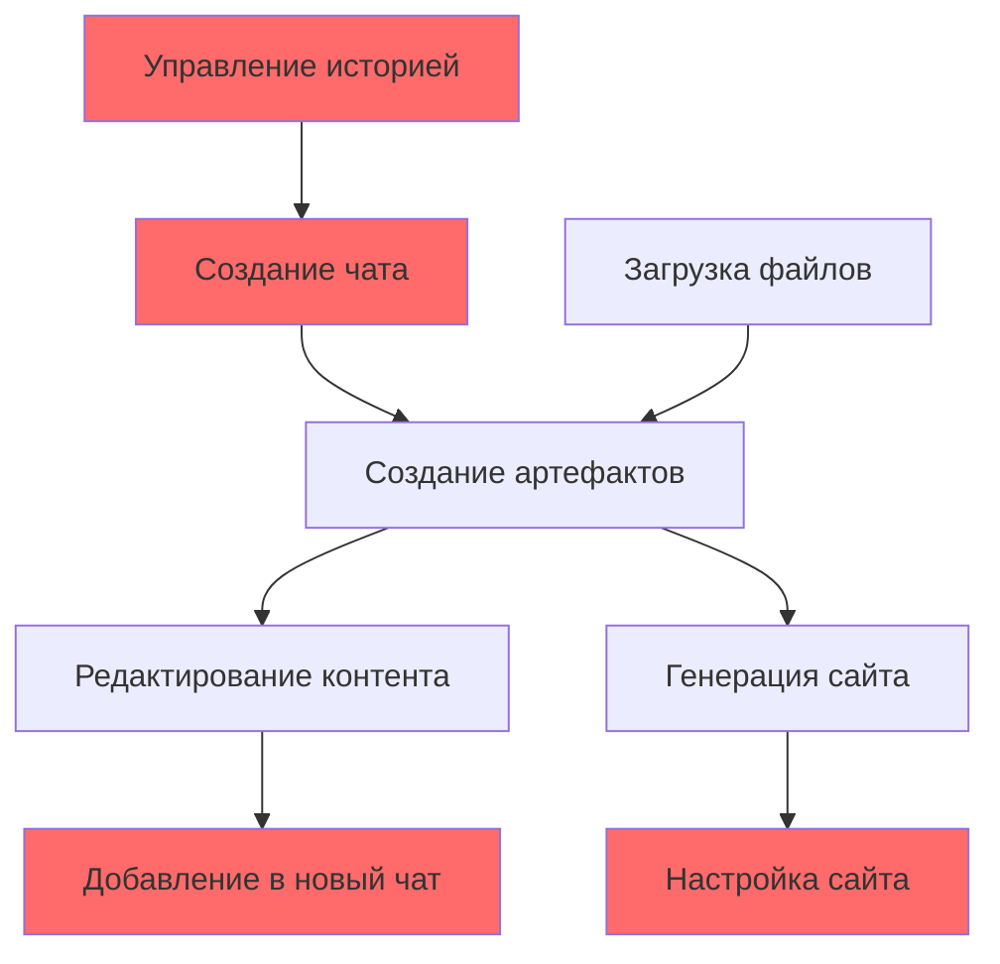

# 🎭 Основные сценарии использования WelcomeCraft

**Версия:** 1.0.0  
**Дата:** 2025-06-16  
**Статус:** Актуально

## HISTORY:
* v1.0.0 (2025-06-16): Создание документации основных пользовательских сценариев с привязкой к UI элементам

---

Этот документ описывает основные сценарии использования WelcomeCraft с детальной привязкой к элементам интерфейса, их `data-testid` и компонентам.

## 🎯 Ключевые пользовательские роли

### 👤 HR-менеджер 
Создает персонализированные онбординг-сайты для новых сотрудников

### 🤖 AI-ассистент
Помогает создавать и редактировать контент через диалог

---

## 📋 Основные сценарии использования

### 1. 🚀 Быстрое создание онбординг-сайта

**Цель:** HR-менеджер хочет создать сайт для нового разработчика за 5 минут

#### Шаги сценария:

1. **Открытие приложения**
   - **Элемент:** Главная страница
   - **Файл:** `app/app/(main)/page.tsx`
   - **Действие:** Автоматический redirect на новый чат

2. **Создание нового чата** 
   - **Элемент:** Кнопка "Новый чат"
   - **testid:** `new-chat-button` *(отсутствует)*
   - **Компонент:** `NewChatButton` в `components/header.tsx`
   - **Действие:** Клик → создание нового чата

3. **Формирование запроса**
   - **Элемент:** Поле ввода сообщения
   - **testid:** `chat-input` ✅
   - **Компонент:** `ChatInput` в `components/chat-input.tsx`
   - **Действие:** Ввод: "Создай онбординг сайт для нового frontend разработчика Алексея"

4. **Отправка сообщения**
   - **Элемент:** Кнопка отправки
   - **testid:** `send-button` ✅
   - **Компонент:** `SendButton` в `components/chat-input.tsx`
   - **Действие:** Клик → отправка запроса AI

5. **Получение результата**
   - **Элемент:** Сообщение с артефактами
   - **testid:** `message` *(отсутствует)*
   - **Компонент:** `Message` в `components/message.tsx`
   - **Результат:** AI создает несколько текстовых артефактов + сайт

6. **Просмотр созданного сайта**
   - **Элемент:** Превью артефакта-сайта
   - **testid:** `artifact-preview` *(отсутствует)*
   - **Компонент:** `ArtifactPreview` в `components/artifact-preview.tsx`
   - **Действие:** Клик → открытие артефакта в панели

7. **Проверка готового сайта**
   - **Элемент:** Панель артефакта
   - **testid:** `artifact-panel` *(отсутствует)*
   - **Компонент:** `Artifact` в `components/artifact.tsx`
   - **Результат:** Полноценный онбординг-сайт готов

### 2. ✏️ Редактирование контента артефакта

**Цель:** Пользователь хочет изменить приветственный текст

#### Шаги сценария:

1. **Выбор артефакта для редактирования**
   - **Элемент:** Превью текстового артефакта в сообщении
   - **testid:** `artifact-preview` *(отсутствует)*
   - **Компонент:** `ArtifactPreview`
   - **Действие:** Клик → открытие в панели артефактов

2. **Открытие редактора**
   - **Элемент:** Панель артефакта (текстовый тип)
   - **testid:** `text-artifact-editor` *(отсутствует)*
   - **Компонент:** `TextEditor` в `artifacts/kinds/text/client.tsx`
   - **Результат:** Открывается редактор Markdown

3. **Внесение изменений**
   - **Элемент:** Текстовый редактор
   - **testid:** `text-artifact-editor` *(отсутствует)*
   - **Компонент:** `Editor` в текстовом плагине
   - **Действие:** Редактирование текста

4. **Автосохранение**
   - **Элемент:** Индикатор сохранения
   - **testid:** `artifact-save-status` *(отсутствует)*
   - **Компонент:** `SaveStatus` в `components/artifact-actions.tsx`
   - **Результат:** Автоматическое сохранение изменений

5. **Просмотр результата**
   - **Элемент:** Превью Markdown
   - **testid:** `text-artifact-preview` *(отсутствует)*
   - **Компонент:** `MarkdownPreview` в текстовом плагине
   - **Результат:** Обновленный контент отображается

### 3. 📤 Добавление артефакта в новый чат

**Цель:** Переиспользование существующего артефакта в другом чате

#### Шаги сценария:

1. **Поиск нужного артефакта**
   - **Элемент:** Панель артефакта
   - **testid:** `artifact-panel` *(отсутствует)*
   - **Компонент:** `Artifact`
   - **Контекст:** Артефакт уже открыт

2. **Копирование в буфер**
   - **Элемент:** Кнопка "Добавить в чат"
   - **testid:** `artifact-add-to-chat-button` *(отсутствует)*
   - **Компонент:** `AddToChatButton` в `components/artifact-actions.tsx`
   - **Действие:** Клик → артефакт копируется в Redis буфер на 60 секунд

3. **Создание нового чата**
   - **Элемент:** Кнопка "Новый чат"
   - **testid:** `new-chat-button` *(отсутствует)*
   - **Компонент:** `NewChatButton`
   - **Действие:** Клик → открытие нового чата

4. **Обнаружение буфера**
   - **Элемент:** Черновик вложения в поле ввода
   - **testid:** `clipboard-artifact` *(отсутствует)*
   - **Компонент:** `ClipboardArtifact` в `components/chat-input.tsx`
   - **Результат:** Автоматическое отображение артефакта в буфере

5. **Подтверждение вложения**
   - **Элемент:** Поле ввода с черновиком
   - **testid:** `chat-input` ✅
   - **Компонент:** `ChatInput`
   - **Действие:** Ввод сообщения + Enter → артефакт прикрепляется

6. **Использование в новом контексте**
   - **Элемент:** Сообщение с прикрепленным артефактом
   - **testid:** `message` *(отсутствует)*
   - **Компонент:** `Message`
   - **Результат:** AI учитывает контекст артефакта в ответе

### 4. 🗑️ Управление историей чатов

**Цель:** Организация рабочего пространства - удаление и переименование чатов

#### Шаги сценария:

1. **Открытие истории**
   - **Элемент:** Боковая панель
   - **testid:** `sidebar-history` *(отсутствует)*
   - **Компонент:** `SidebarHistory` в `components/sidebar-history.tsx`
   - **Результат:** Список всех чатов пользователя

2. **Выбор чата для действий**
   - **Элемент:** Элемент чата в истории
   - **testid:** `chat-item` *(отсутствует)*
   - **Компонент:** `SidebarHistoryItem` в `components/sidebar-history-item.tsx`
   - **Действие:** Наведение → появление кнопки меню

3. **Открытие меню действий**
   - **Элемент:** Кнопка меню элемента
   - **testid:** `chat-item-menu-button` *(отсутствует)*
   - **Компонент:** `ChatItemMenu`
   - **Действие:** Клик → выпадающее меню

4. **Переименование чата**
   - **Элемент:** Кнопка "Переименовать"
   - **testid:** `chat-item-rename-button` *(отсутствует)*
   - **Компонент:** `RenameButton`
   - **Действие:** Клик → инлайн редактирование названия

5. **Удаление чата**
   - **Элемент:** Кнопка "Удалить"
   - **testid:** `chat-item-delete-button` *(отсутствует)*
   - **Компонент:** `DeleteButton`
   - **Действие:** Клик → подтверждение → удаление

### 5. 🔧 Работа с кодом (Code артефакты)

**Цель:** Создание и выполнение Python кода для анализа данных

#### Шаги сценария:

1. **Запрос на создание кода**
   - **Элемент:** Поле ввода
   - **testid:** `chat-input` ✅
   - **Компонент:** `ChatInput`
   - **Действие:** Ввод: "Создай Python код для анализа CSV файла"

2. **Получение code артефакта**
   - **Элемент:** Превью code артефакта
   - **testid:** `artifact-preview` *(отсутствует)*
   - **Компонент:** `ArtifactPreview`
   - **Результат:** AI создает Python код

3. **Открытие редактора кода**
   - **Элемент:** Панель code артефакта
   - **testid:** `code-artifact-editor` *(отсутствует)*
   - **Компонент:** `CodeEditor` в `artifacts/kinds/code/client.tsx`
   - **Результат:** Monaco Editor с Python кодом

4. **Редактирование кода**
   - **Элемент:** Monaco Editor
   - **testid:** `code-artifact-editor` *(отсутствует)*
   - **Компонент:** `CodeEditor`
   - **Действие:** Изменение кода

5. **Выполнение кода**
   - **Элемент:** Кнопка "Запустить"
   - **testid:** `code-artifact-run-button` *(отсутствует)*
   - **Компонент:** `RunButton`
   - **Действие:** Клик → выполнение через Pyodide

6. **Просмотр результатов**
   - **Элемент:** Область вывода
   - **testid:** `code-artifact-output` *(отсутствует)*
   - **Компонент:** `ConsoleOutput`
   - **Результат:** Вывод консоли + matplotlib графики

### 6. 🌐 Генерация и настройка сайта

**Цель:** Создание сложного онбординг-сайта с несколькими блоками

#### Шаги сценария:

1. **Создание базовых артефактов**
   - **Элемент:** Чат с AI
   - **testid:** `chat-input` ✅
   - **Компонент:** `ChatInput`
   - **Действие:** Серия запросов для создания текстов, контактов, ссылок

2. **Генерация сайта**
   - **Элемент:** Поле ввода
   - **testid:** `chat-input` ✅
   - **Компонент:** `ChatInput`
   - **Действие:** Ввод: "Собери сайт используя созданные артефакты"

3. **Открытие редактора сайта**
   - **Элемент:** Site артефакт
   - **testid:** `site-artifact-editor` *(отсутствует)*
   - **Компонент:** `SiteEditor` в `artifacts/kinds/site/client.tsx`
   - **Результат:** JSON редактор структуры сайта

4. **Добавление нового блока**
   - **Элемент:** Кнопка "Добавить блок"
   - **testid:** `site-add-block-button` *(отсутствует)*
   - **Компонент:** `AddBlockButton`
   - **Действие:** Выбор типа блока → добавление

5. **Настройка блока**
   - **Элемент:** Настройки блока сайта
   - **testid:** `site-block` *(отсутствует)*
   - **Компонент:** `SiteBlock`
   - **Действие:** Выбор артефактов для слотов, pin/latest режим

6. **Просмотр готового сайта**
   - **Элемент:** Превью сайта
   - **testid:** `artifact-preview` *(отсутствует)*
   - **Компонент:** `ArtifactPreview`
   - **Результат:** Ссылка на готовый сайт `/s/{site-id}`

### 7. 📁 Загрузка и создание артефактов из файлов

**Цель:** Загрузка изображений/документов с автоматическим созданием артефактов

#### Шаги сценария:

1. **Открытие файлового диалога**
   - **Элемент:** Кнопка прикрепления
   - **testid:** `attachments-button` ✅
   - **Компонент:** `AttachButton` в `components/chat-input.tsx`
   - **Действие:** Клик → открытие file picker

2. **Выбор файлов**
   - **Элемент:** Файловый input (скрытый)
   - **testid:** *(hidden input)*
   - **Компонент:** Hidden file input
   - **Действие:** Выбор одного или нескольких файлов

3. **Отображение процесса загрузки**
   - **Элемент:** Превью загружаемых файлов
   - **testid:** `attachments-preview` ✅
   - **Компонент:** `AttachmentsPreview` в `components/chat-input.tsx`
   - **Результат:** Skeleton loader для каждого файла

4. **Завершение загрузки**
   - **Элемент:** Сообщение с созданными артефактами
   - **testid:** `message` *(отсутствует)*
   - **Компонент:** `Message`
   - **Результат:** Автоматически созданные image/text артефакты

## 🎯 Критические точки пользовательского опыта

### ❌ Заблокированные сценарии (отсутствующие testid)

1. **Создание нового чата** - нет `new-chat-button`
2. **Управление артефактами** - нет `artifact-close-button`, `artifact-add-to-chat-button`
3. **Редактирование сообщений** - нет `message-edit-button`
4. **Управление историей** - нет `chat-item-delete-button`

### ✅ Работающие сценарии (есть testid)

1. **Отправка сообщений** - есть `chat-input`, `send-button`
2. **Загрузка файлов** - есть `attachments-button`, `attachments-preview`

## 🔗 Связи между сценариями

**Красные блоки** - сценарии с отсутствующими критическими testid

## 🎪 Паттерны взаимодействия

### 1. **AI-First диалог**
Основной паттерн: пользователь описывает что хочет → AI создает → пользователь уточняет

### 2. **Артефакт-центричный workflow**
Все действия крутятся вокруг создания, редактирования и переиспользования артефактов

### 3. **Асинхронный UX**
Пользователь видит результат сразу, детали подгружаются в фоновом режиме

### 4. **Версионированный контент**
Все изменения сохраняются как новые версии, можно откатиться к предыдущим

---

Этот документ должен использоваться для:
- **Планирования E2E тестов** - каждый сценарий = тест
- **Приоритизации разработки** - критические отсутствующие testid  
- **UX аудита** - проверка завершенности пользовательских путей
- **Документирования API** - какие endpoints используются в каждом сценарии